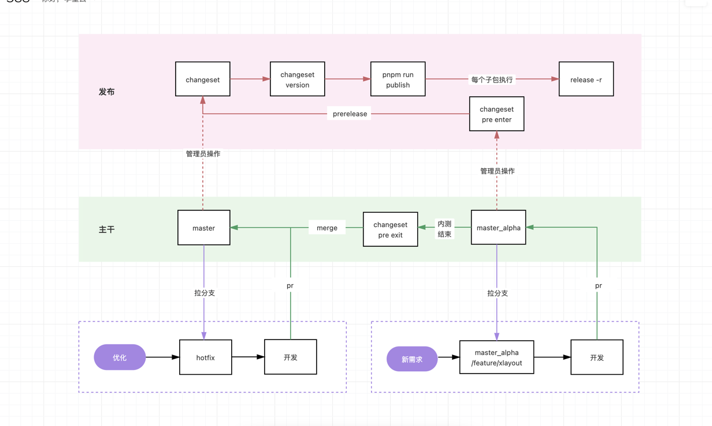

# template-monorepo-pnpm
react+monorepo仓库模版

### 版本管理流程
一般情况下，包的发布会经历几个阶段：

* alpha -> latest 内部的包一般要经过自测、内测，项目发布前，才能发布为正式的 latest 版本。
* beta -> latest 对外使用的包，需要经过公测阶段，稳定后才可以发布为正式的 latest 版本。
* (alpha/beta) -> next -> latest 大的 major 主版本变化的版本，需要先经历测试后才能发布为稳定的 next 版本，等生态或周围的项目影响度最低的时候，再发布为正式的 latest 版本。
### changeset 管理版本
作为 pnpm 的 monorepo 仓库，包之间的互相引用是使用的 workspace 规则，譬如 A 依赖 "@xx/util": "workspace:^1.0.3"，此时包的发布必须使用 pnpm publish 才能将 workspace 版本规则替换为正确版本。

所以，不能使用 changeset publish 来发布包。

另外，由于 changeset 管理 prelease 版本只有一个全局状态控制，当进入 prelease 模式后所有包都只能发布 pre 版本。

### 工作流程

需要有一个主干分支用来将测试版本的包发布为正式版本，对应包自己的测试版本需要单独拉分支去发包。

举例：packages/demo 需要新增组件 banner

* 管理员
* 新拉分支 feature/banner
* 编写代码
* 创建 pull request 到分支 master_alpha/feature/banner
* 审核通过后
* 添加改动 changeset add
* 进入 pre 模式：changeset pre enter alpha
* 更改版本 changeset version
* 提交模式变更
* 发布 pnpm run publish
* 推送 tag git push --follow-tags

所有的操作都在外层根目录 pnpm-package 下执行，子项目需要自行添加 release 命令。
